# Module overview

This module establishes key concepts, historical questions, and a few shared inquiry practices that will guide our course. We begin by examining what it means to study schooling for diverse populations in American society. This module asks us to connect historical thinking, educational inquiry, and personal reflection to our thinking about the "schooling," and what we mean by "schooling." We start by considering how diversity, power, institutions, and historical memory shape educational experiences and opportunities.

## Guiding questions

-   **What is the difference between education and schooling?**
-   **What purposes should schools serve in a democratic society?**
-   How do race, culture, language, gender, income, and ability shape educational experience and opportunity?
-   How have historical struggles over diversity and inequality shaped American schools?
-   What is the relationship among equal access, justice, democracy, and teaching?
-   How do power, privilege, prejudice, discrimination, and systems of oppression affect schools and communities?
-   Why does historical thinking matter for educators, students, and informed citizens?
-   What kinds of sources can help us understand educational history?
-   What kind of professional identity and agency do I want to develop?

## Key concepts and inquiries

-   Schooling and education
-   Diversity and multiculturalism
-   Social justice
-   Educational opportunity and unequal access
-   Democracy and citizenship
-   Archives, artifacts, and primary sources
-   Power, privilege, prejudice, and discrimination
-   Professional identity and agency
-   Historical thinking and historical significance

---

## Education vs. schooling

Although people often use the terms interchangeably, **education** and **schooling** are not identical.

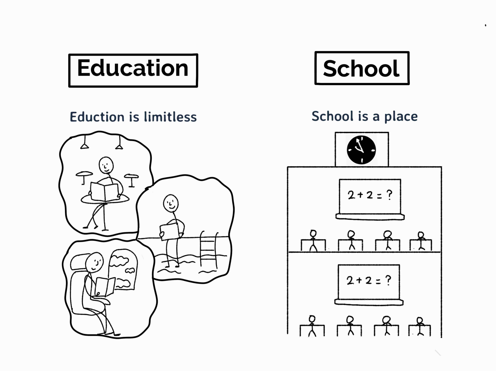

---

## Education vs. schooling

> "Don't let schooling interfere with your education."

::: callout-note
## Education

Education is the broad process through which people develop knowledge, skills, values, identities, relationships, and ways of understanding the world. Education occurs in schools, families, communities, workplaces, religious institutions, cultural organizations, social movements, and everyday life.
:::

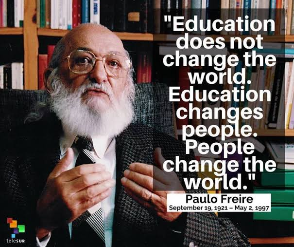

---

## Education vs. schooling

::: callout-note
## Schooling

Schooling refers more specifically to formal, organized educational experiences provided through institutions such as public schools, private schools, colleges, universities, and other credentialing systems.

Schooling includes curriculum, assessment, policies, schedules, rules, professional roles, funding structures, and institutional decisions that shape access to learning.
:::

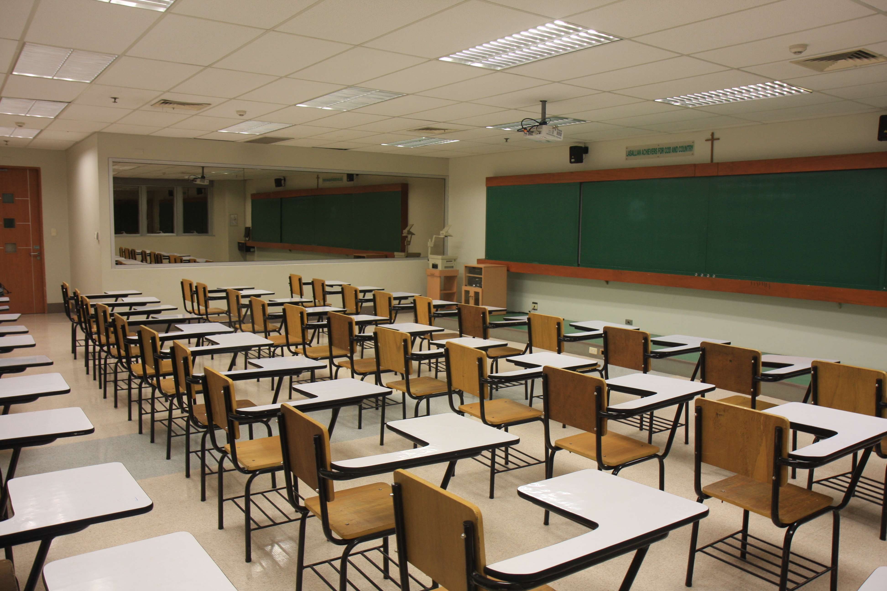

---

### Questions for discussion

-   Can a person be educated outside of school?
-   **What do schools provide that other educational settings may not provide?**
-   What kinds of knowledge, histories, identities, and ways of being are recognized or ignored in formal schooling?
-   When do schooling and education support one another? When might they conflict?

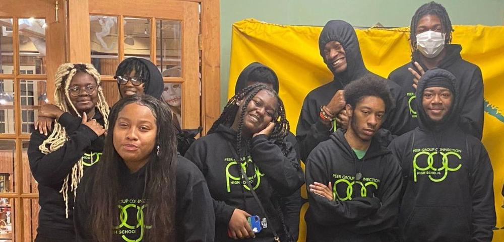

---

## Diversity

Diversity describes differences among people and communities.

::: callout-tip
## Diversity

Diversity includes differences related to race, ethnicity, culture, language, gender, sexuality, income, religion, nationality, immigration history, disability, ability, family structure, geography, and other social locations.

Diversity is not simply a list of individual characteristics. It also concerns how institutions respond to differences and how social systems distribute recognition, resources, power, and opportunity.
:::

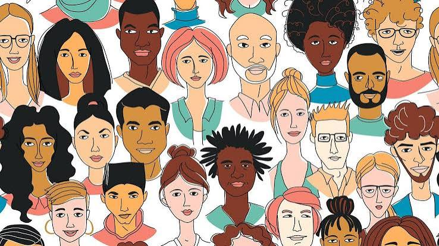
---

### Diversity and educational opportunity

Race, culture, language, gender, income, and ability can shape:

-   Access to schools, courses, teachers, learning materials, and technology.
-   How students and families are perceived, categorized, or treated.
-   Curriculum content and whose histories, languages, knowledge, and experiences are represented.
-   Discipline, special education, tracking, testing, and other institutional practices.
-   Students’ experiences of belonging, safety, dignity, participation, and academic opportunity.

---

## Multiculturalism, diversity, and social justice

These terms are related, but they do not mean the same thing.

::: callout-note
## Multiculturalism

Multiculturalism is an approach that recognizes, studies, and values the histories, cultures, perspectives, and contributions of multiple groups in society.

In education, multicultural approaches may shape curriculum, texts, classroom discussion, school programming, and institutional practices.
:::

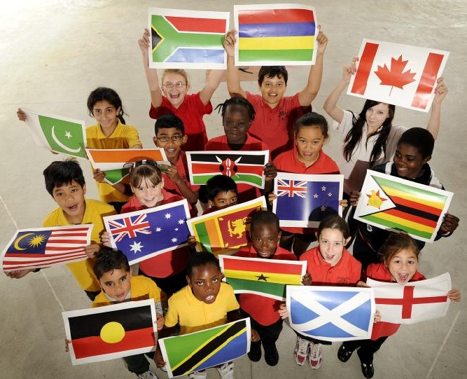
---

::: callout-note
## Social justice

Social justice concerns the fair distribution of rights, resources, recognition, opportunity, and participation. In education, social justice asks how schools can identify and challenge inequities rather than simply treating unequal conditions as normal or inevitable.
:::

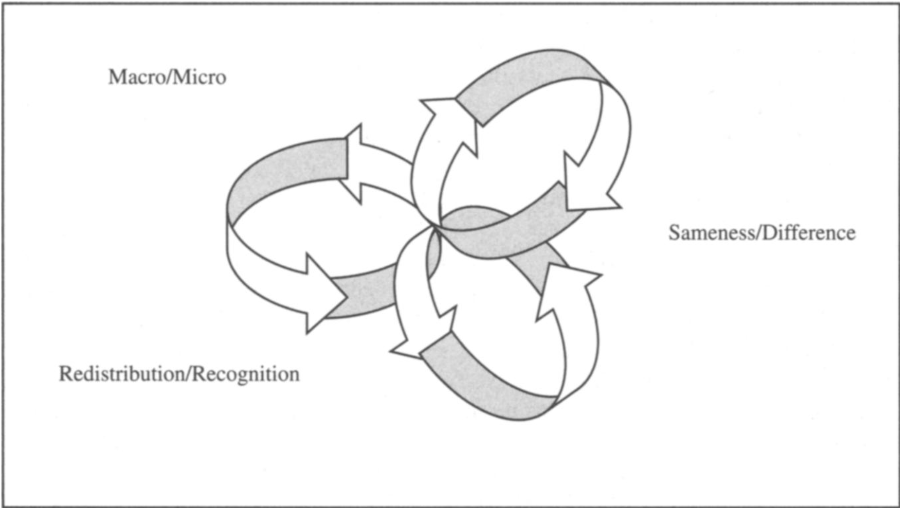

----

## Equity and equality

::: callout-important

**Equality** generally means providing the same resources, rules, or treatment to everyone.

**Equity** means responding to unequal conditions, barriers, and needs in ways intended to make genuine access, participation, and opportunity possible.

The distinction matters because identical treatment does not always produce fair or equitable outcomes.
:::

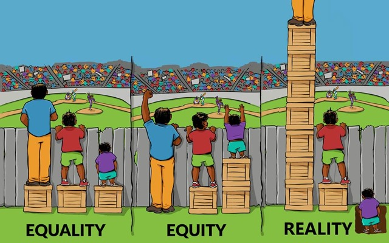
---

## Power, privilege, prejudice, and discrimination

Understanding schooling in American society requires attention to how social power operates. Schools do not exist apart from their political, economic, legal, cultural, and historical contexts.

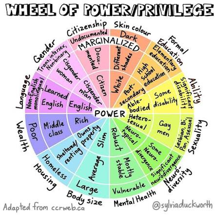

---

::: callout-note
## Power

Power is the ability to shape decisions, define what counts as knowledge, distribute resources, establish rules, influence institutions, and affect the conditions of other people’s lives.
:::

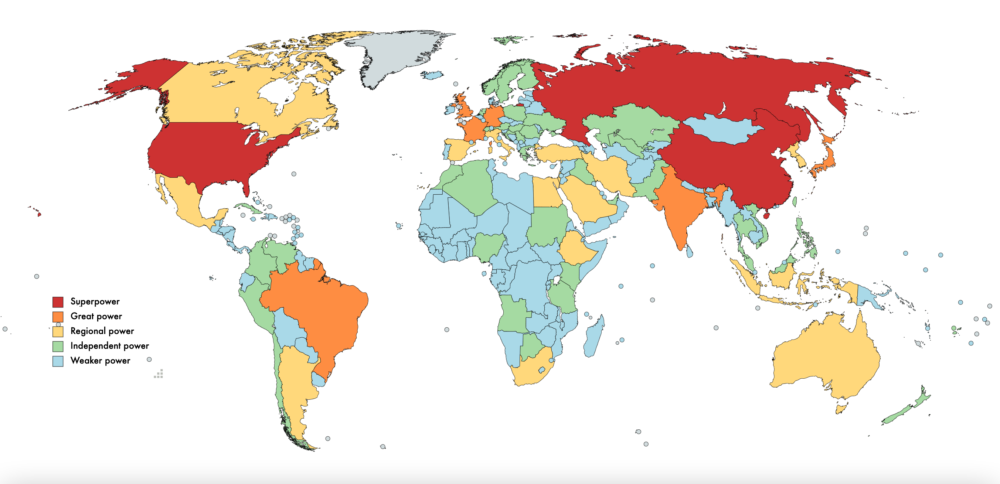

---

::: callout-note
## Privilege

Privilege refers to unearned advantages or reduced barriers that individuals or groups may experience because of their social position within broader systems of power.
:::

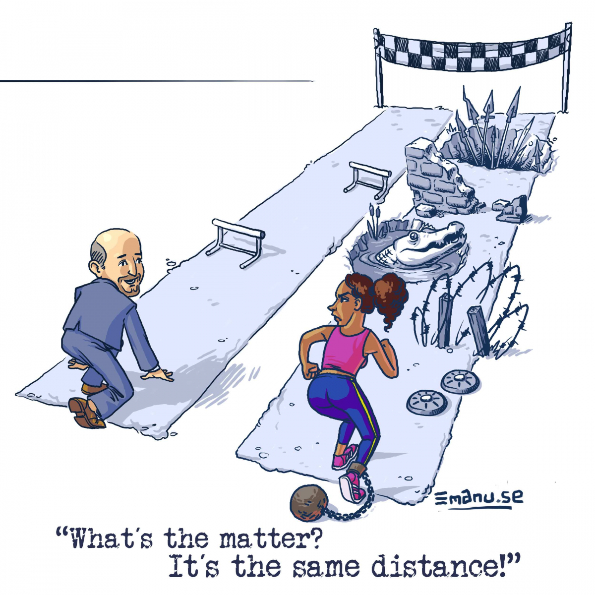

---

::: callout-note
## Prejudice

Prejudice is a preconceived judgment, belief, or attitude about a person or group that is not based on adequate knowledge or individual experience.
:::

---

::: callout-note
## Discrimination

Discrimination is unequal treatment, exclusion, restriction, or harm directed toward people because of their membership in a social group or because they are perceived to belong to that group.
:::

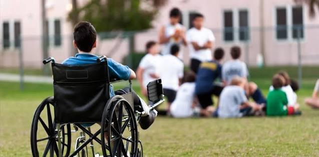
---

::: callout-important
## Systems of oppression

Systems of oppression are interconnected institutional, cultural, legal, economic, and social arrangements that produce and maintain unequal power, resources, recognition, and opportunity across social groups.

In this course, we will examine how such systems affect schooling, teaching, learning, policy, access, and educational outcomes.
:::

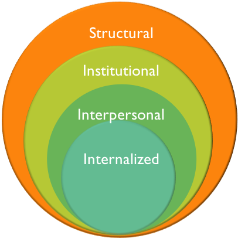

---

## Educational opportunity

Educational opportunity is more than simply being enrolled in a school. It concerns whether students have meaningful access to high-quality learning conditions, relationships, resources, curriculum, participation, and pathways.

::: callout-tip
## Equal access

Equal access refers to the principle that students should not be excluded from educational opportunities because of race, culture, language, gender, income, ability, disability, or other social characteristics.

Questions about equal access include who can enter schools, courses, programs, activities, and decision-making spaces, as well as what supports are necessary for meaningful participation.
:::

---

### Questions for discussion

-   What should count as an educational opportunity?
-   **Can separate institutions be equal in practice?**
-   How do funding, transportation, housing, curriculum, discipline, testing, and teacher assignment shape access?
-   What responsibilities do educators, policymakers, courts, families, and communities have for creating equitable educational conditions?

---

## Historical timelines and archival inquiry

::: callout-note
## Historical thinking

Historical thinking is the practice of using evidence, context, chronology, and interpretation to understand the past and its relationships to the present and future.

Historical thinking asks us to consider why we examine the past in order to better understand the world around us and the world ahead of us. For educators and informed citizens, it helps us interpret institutions, policies, social conditions, and unequal opportunities with greater care.
:::

## Historical artifacts

Historical artifacts and primary sources help us investigate how people, institutions, communities, policies, and events shaped educational experiences. In this course, historical inquiry is not only about identifying facts from the past; it is also about asking how evidence, interpretation, and historical context shape what we understand about schools and society.

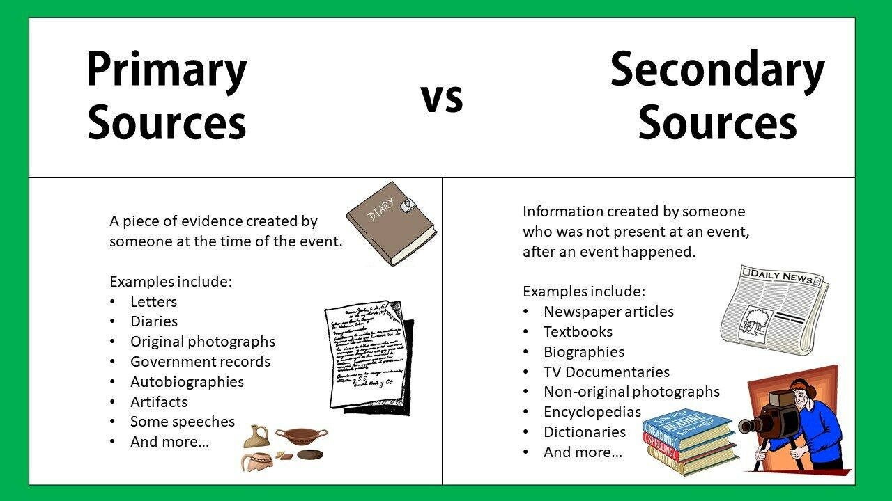

---

::: callout-tip
## Primary source

A primary source is material created during the historical period being studied or by someone directly connected to the event, experience, institution, or idea under investigation.

Examples include court opinions, laws, letters, newspaper articles, photographs, speeches, school records, meeting minutes, maps, oral histories, and archival documents.
:::

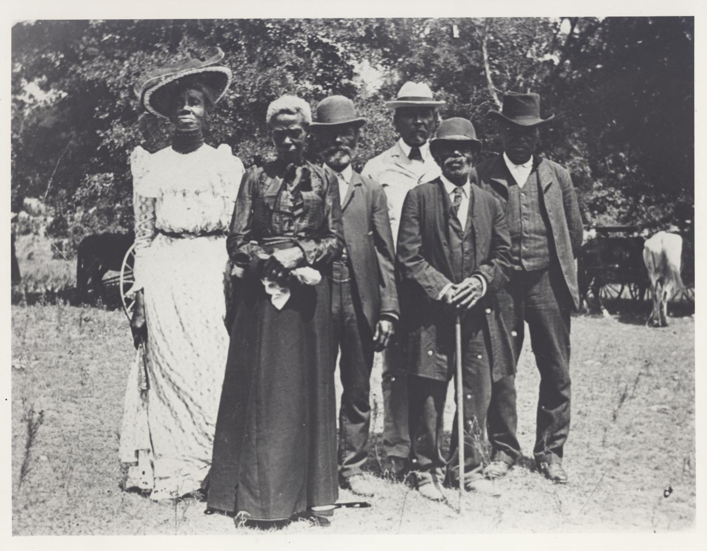

---

::: callout-tip
## Historical artifact

A historical artifact is an object, document, image, record, or other source that provides evidence about people, institutions, events, and social life in the past.

For this course, artifacts may directly concern education or may provide broader historical context for understanding schools, law, communities, race, citizenship, and educational opportunity.
:::

::: callout-important
## Major historical event

A major historical event is an event that meets a stated set of criteria for historical significance.

As part of the timeline activity, your group will develop and apply its own definition. The point is not merely to label an event “important,” but to explain what makes it historically significant, to whom, at what scale, and with what consequences.
:::

---

### From physical to digital timelines

In this course, we will work with others to create physical timelines and then contribute to a shared class digital timeline/database.

Your group should have:

-   Identified and defined criteria for major historical events.
-  Identified a set of "minor" historical events.

Your groups will now:

-   Identify and document two primary-source artifacts situated in your period.
-   Insert event data and archival information into the class database.

---

::: callout-note
## Documentation guide

Use the [historical documentation guide](../documentation.qmd) when preparing entries for the class timeline and archival-research database.
:::

## Reflection

As you coontinue the timeline activity, consider:

-   Why might two groups select different events as historically significant?
-   What counts as evidence for a claim about historical importance?
-   How can a local event be important even if it is not nationally known?
-   How might a source be directly related to education without being classified as a major historical event?

---

# Coming up: Philosophies of education

## Starting questions

A philosophy of education is not simply a list of preferred classroom activities or a philosophy of teaching. It is an argument about the purposes, values, obligations, and possibilities of education.

As you begin drafting your philosophy of education, consider:

-   What purposes should schools serve in a democratic society?
-   How have historical struggles over racial, cultural, linguistic, gender, income, and ability diversity shaped my understanding of education?
-   What is the relationship among equal access, justice, democracy, and teaching?
-   How should educators respond to unequal histories and present educational conditions?
-   What kind of professional identity and agency do I want to develop?

::: callout-important
## Philosophy of education

Your final individual philosophy of education should communicate your developing understanding of the purposes of education and the relationships among schools, democracy, access, diversity, power, and social justice.

**It is not a philosophy of teaching**. Your work should move beyond preferred instructional strategies to address the broader purposes and responsibilities of education.
:::

---

## Looking ahead

Later in the semester, we will work in trial groups focused on *Plessy v. Ferguson* or *Brown v. Board of Education*.

The historical thinking, archival research, documentation, and philosophical questions introduced in this module will support that work. Trial groups will use historical evidence to build context, analyze arguments, represent competing perspectives, and consider the educational consequences of Supreme Court decisions.

::: callout-tip
## Start building connections

As you encounter an event, artifact, concept, or course reading, ask:

-   Does this help explain the historical context of *Plessy* or *Brown*?
-   Does it illuminate questions about segregation, citizenship, public institutions, schooling, or equal access?
-   Could it become a source, claim, question, or piece of evidence for a trial group?
:::
