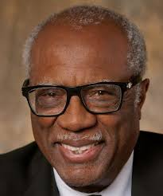

## Module overview

This module introduces historical traditions and contemporary discourses in philosophies of education. We will examine how philosophical ideas shape beliefs about the purposes of education, the role of schools in democratic society, the relationships among knowledge, learning, teaching, and citizenship, and the distribution of educational opportunity.

## Guiding questions

-   What is a philosophy of education?
-   What purposes should education and schools serve in a democratic society?
-   How have major philosophical traditions shaped American educational thought and practice?
-   How do different philosophies understand knowledge, learning, authority, curriculum, and citizenship?

## Key concepts

-   Philosophy of education
-   Democratic education
-   Educational aims and purposes
-   Knowledge and curriculum
-   Authority and freedom
-   Equality, equity, and access
-   Diversity and multiculturalism
-   Social justice
-   Professional identity and agency

------------------------------------------------------------------------

## James Banks

### Multicultural Education

James Banks developed a framework for integrating multicultural content into curricula. His work emphasizes five dimensions:

-   Content integration
-   Knowledge construction
-   Prejudice reduction
-   Equity pedagogy
-   An empowering school culture and social structure

Multicultural education involves more than adding diverse figures or holidays to the curriculum; it also requires examining how knowledge is constructed and how school structures distribute opportunity.

------------------------------------------------------------------------

## Django Paris

### Culturally Sustaining Pedagogy

Django Paris extended culturally relevant pedagogy through an explicit focus on **sustaining** linguistic, literate, and cultural pluralism in schooling.

-   Centers students’ existing cultural and linguistic resources
-   Challenges assimilationist assumptions about achievement
-   Links pedagogy to positive social transformation
-   Treats pluralism as an educational asset rather than a deficit

------------------------------------------------------------------------

## Carter G. Woodson

### Black Education

Carter G. Woodson advocated for the centrality of Black history in education.

-   Founded Negro History Week, which later developed into Black History Month
-   Critiqued schooling that devalued Black history, knowledge, and agency
-   Developed a lasting critique of the “mis-education” of African Americans
-   Linked historical knowledge to collective self-determination

------------------------------------------------------------------------

## Bob Moses

### Literacy Education

Bob Moses combined civil-rights activism with literacy and mathematics education.

-   Treated literacy, including mathematical literacy, as a civil-rights issue
-   Viewed quantitative knowledge as a resource for participation and empowerment
-   Worked with underserved communities through the Algebra Project
-   Connected educational opportunity to political and economic access

------------------------------------------------------------------------

## Paulo Freire

### Education for Liberation

Paulo Freire developed critical pedagogy, arguing that education should be a practice of freedom rather than domination.

-   Emphasized dialogue rather than one-way transmission
-   Distinguished critical inquiry from “banking” models of education
-   Advanced critical consciousness as an educational aim
-   Connected learning to learners’ social realities and collective action

**Instructional implication:** Students should be positioned as knowledgeable participants who can investigate, name, and act on conditions shaping their lives.

------------------------------------------------------------------------

## Jo-ann Archibald Q’um Q’um Xiiem

### Indigenous Storywork

Jo-ann Archibald Q’um Q’um Xiiem developed a framework for using Indigenous stories in education.

Her seven principles are:

-   Respect
-   Responsibility
-   Reciprocity
-   Reverence
-   Holism
-   Interrelatedness
-   Synergy

**Instructional implication:** Stories can be understood as sources of intellectual, ethical, emotional, spiritual, and relational learning—not merely as illustrative classroom materials.

------------------------------------------------------------------------

## Bryan McKinley Jones Brayboy

### Tribal Critical Race Theory

Bryan McKinley Jones Brayboy extended Critical Race Theory to address the particular political, legal, historical, and educational contexts of Indigenous peoples.

-   Centers tribal sovereignty and self-determination
-   Examines colonization as enduring rather than merely historical
-   Recognizes storytelling as theory-building
-   Affirms Indigenous knowledge systems and community-based understandings

**Instructional implication:** Equity work involving Indigenous communities must attend to sovereignty, place, historical relationships, and Indigenous intellectual traditions.

------------------------------------------------------------------------

## Albert Bandura

### Observational Learning Theory

Albert Bandura argued that behavior can be learned through observing others.

-   Learners attend to models and the consequences models receive
-   Observation may influence behavior even without direct reinforcement
-   Modeling can shape skills, expectations, and beliefs about one’s capabilities
-   Social environments are important sources of learning

**Instructional implication:** Teachers, peers, media, and classroom norms all provide models that students may observe and emulate.

------------------------------------------------------------------------

## Asa Hilliard

### African-Centered Education

Asa Hilliard emphasized the educational importance of cultural identity, particularly for African American students.

-   Advocated for curriculum that includes African and African American history and culture
-   Critiqued deficit-oriented accounts of Black learners and communities
-   Highlighted intellectual traditions that conventional curricula often marginalize
-   Connected cultural affirmation with rigorous learning

**Instructional implication:** High expectations and cultural responsiveness should be mutually reinforcing rather than treated as competing priorities.

------------------------------------------------------------------------

## Abraham Maslow

### Hierarchy of Needs

Abraham Maslow proposed that people strive to satisfy different categories of needs.

From lower to higher, the commonly presented levels are:

1.  Physiological needs
2.  Safety needs
3.  Love and belonging
4.  Esteem
5.  Self-actualization

**Instructional implication:** Learning conditions are shaped by students’ material security, safety, belonging, dignity, and opportunities for meaningful growth.

------------------------------------------------------------------------

## Carol Dweck

### Growth Mindset

Carol Dweck examines how beliefs about intelligence influence motivation and achievement.

| Orientation | Core belief | Likely response to challenge |
|------------------------|------------------------|------------------------|
| Fixed mindset | Ability is largely unchangeable | Avoid challenge or interpret difficulty as evidence of limited ability |
| Growth mindset | Ability can develop through learning, strategy, feedback, and effort | Treat challenge as an opportunity to learn |

**Instructional implication:** Feedback can emphasize strategies, revision, persistence, and learning processes rather than presenting achievement as evidence of fixed ability.

------------------------------------------------------------------------

## Erik Erikson

### Socioemotional Development

Erik Erikson described development as a sequence of psychosocial crises across the lifespan.

-   Early development begins with trust versus mistrust
-   Later stages involve tensions such as autonomy versus shame, initiative versus guilt, and industry versus inferiority
-   Adolescence is associated with identity versus role confusion
-   Development continues through adulthood

**Instructional implication:** Classroom experiences can influence students’ senses of competence, belonging, identity, and agency.

------------------------------------------------------------------------

## Leon Festinger

### Cognitive Dissonance

Leon Festinger’s theory of cognitive dissonance proposes that inconsistencies between beliefs, values, attitudes, and behaviors can create psychological discomfort.

-   Dissonance may motivate a person to change beliefs, behavior, or interpretations
-   Learners may revise understandings when existing explanations no longer fit evidence or experience
-   The idea is often connected to constructivist accounts of conceptual change

**Instructional implication:** Carefully designed questions, evidence, and discrepant events can help students recognize and reconsider incomplete understandings.

------------------------------------------------------------------------

## Sigmund Freud

### Levels of Consciousness

Sigmund Freud proposed that the mind operates across conscious and unconscious levels.

His structural model includes:

-   **Id:** Primitive motivations and desires
-   **Ego:** The mediating, reality-oriented component
-   **Superego:** Internalized moral standards and conscience

**Instructional implication:** Although not an instructional theory, Freudian ideas have influenced ways educators and psychologists think about motivation, emotion, conflict, and development.

------------------------------------------------------------------------

## Gloria Ladson-Billings

### Culturally Relevant Pedagogy

Gloria Ladson-Billings developed culturally relevant pedagogy, which argues that teaching should build from students’ cultural backgrounds and community knowledge.

Culturally relevant teaching seeks to support:

-   Academic success
-   Cultural competence
-   Critical consciousness

**Instructional implication:** Strong teaching advances rigorous disciplinary learning while supporting students’ cultural identities and their capacity to analyze social inequities.

------------------------------------------------------------------------

## Howard Gardner

### Multiple Intelligences

Howard Gardner proposed that individuals possess distinct forms of intelligence, commonly including:

-   Linguistic
-   Logical-mathematical
-   Spatial
-   Bodily-kinesthetic
-   Musical
-   Intrapersonal
-   Interpersonal

**Instructional implication:** Teachers can offer varied ways for students to encounter, represent, practice, and demonstrate learning rather than relying on a single mode of instruction or assessment.

------------------------------------------------------------------------

## Ivan Pavlov

### Classical Conditioning

Ivan Pavlov’s classical conditioning model describes the association of a new stimulus with an existing stimulus-response pairing.

Classic example:

-   Food produces salivation in dogs
-   A bell is repeatedly paired with food
-   The bell eventually produces salivation even when food is absent

**Instructional implication:** Learners can form associations between classroom conditions, emotional responses, cues, and academic activities.

------------------------------------------------------------------------

## Jarvis Givens

### Fugitive Pedagogy

Jarvis Givens examines a hidden tradition of Black teaching developed under oppressive educational conditions.

-   Documents how Black educators navigated systems designed to constrain Black learning
-   Centers pedagogical care, intellectual resistance, and racial uplift
-   Shows how teaching has served as a site of freedom-making
-   Connects historical study to current educational practice

**Instructional implication:** Teachers’ practices can carry intellectual and ethical commitments that exceed official curricula, policies, and institutional constraints.

------------------------------------------------------------------------

## Jean Piaget

### Developmental Epistemology

Jean Piaget theorized that children’s thinking develops through qualitatively different stages.

| Approximate age | Stage | General characterization |
|------------------------|------------------------|------------------------|
| 0–2 years | Sensorimotor | Learning through perception and motor activity |
| 3–7 years | Preoperational | Intuitive and symbolic thinking |
| 8–11 years | Concrete operational | Logical reasoning about concrete situations |
| 12–15 years and beyond | Formal operational | Abstract and hypothetical reasoning |

**Instructional implication:** Learning tasks should be responsive to learners’ developing ways of reasoning, while avoiding assumptions that age alone fully determines capability.

------------------------------------------------------------------------

## Jerome Bruner

### Constructivist Theory

Jerome Bruner argued that learners actively construct knowledge by relating new ideas to their existing schemas or mental models.

-   Learning involves making meaning, not merely receiving information
-   Prior knowledge shapes how new information is interpreted
-   Discovery, inquiry, and revisiting ideas can support understanding
-   Instruction can be organized so concepts return with increasing sophistication

**Instructional implication:** Teaching should elicit prior ideas, create opportunities for inquiry, and help students revise and extend their existing understandings.

------------------------------------------------------------------------

## John Dewey

### Learning by Doing

John Dewey emphasized that learning occurs through experience, inquiry, and reflection.

-   Knowledge grows through engagement with meaningful problems
-   Experience becomes educative when learners reflect on it
-   Schools can prepare students for democratic participation
-   Classroom activity should connect to learners’ lives and communities

**Instructional implication:** Students learn deeply when they investigate authentic questions, test ideas, collaborate, and reflect on consequences.

------------------------------------------------------------------------

## John Hattie

### Visible Learning

John Hattie synthesizes meta-analytic research to identify influences associated with student achievement.

-   Emphasizes the use of evidence in instructional decision-making
-   Draws attention to feedback, teacher clarity, formative assessment, and visible learning processes
-   Encourages educators to examine the impact of their teaching
-   Promotes ongoing assessment of whether students are making progress

**Instructional implication:** Teachers can use multiple sources of evidence to make learning goals, progress, and next steps visible to students and to inform instruction.

------------------------------------------------------------------------

## Ken Robinson

### Creativity in Education

Ken Robinson advocated for education that nurtures creativity, divergent thinking, and diverse forms of human talent.

-   Critiqued narrow definitions of achievement
-   Questioned overly standardized approaches to schooling
-   Called for personalized and varied learning opportunities
-   Emphasized the relationship between creativity, identity, and engagement

**Instructional implication:** Curriculum and assessment can create room for multiple pathways, imaginative problem-solving, artistic expression, and students’ developing interests.

------------------------------------------------------------------------

## Lawrence Kohlberg

### Stages of Moral Development

Lawrence Kohlberg described moral reasoning in three broad levels:

| Level | General orientation |
|------------------------------------|------------------------------------|
| Pre-conventional | Moral decisions are oriented toward self-interest and consequences |
| Conventional | Moral decisions are oriented toward social approval, rules, and local expectations |
| Post-conventional | Moral decisions are oriented toward broader ethical principles |

**Instructional implication:** Ethical discussion can invite students to explain and examine the reasons underlying judgments, rules, obligations, and competing values.

------------------------------------------------------------------------

## John Locke

### Tabula Rasa

John Locke’s tabula rasa metaphor characterizes the mind as a “blank slate” shaped by experience.

-   Emphasizes the formative influence of environment and education
-   Historically influenced later empiricist and behaviorist traditions
-   Raises questions about the relative roles of experience, teaching, and individual development

**Instructional implication:** Educational environments, experiences, and instruction matter profoundly—but learners should not be treated as passive recipients of knowledge.

------------------------------------------------------------------------

## Lev Vygotsky

### Social Development Theory and ZPD

Lev Vygotsky argued that social interaction is central to cognitive development.

The **Zone of Proximal Development (ZPD)** distinguishes between:

-   What a learner can do independently
-   What a learner can do with assistance from a more capable peer, teacher, or other support

The ZPD provides a theoretical basis for **scaffolding**.

**Instructional implication:** Teachers can design supports, collaborative structures, prompts, models, and feedback that help learners do increasingly complex work independently.

------------------------------------------------------------------------

## Carl Rogers

### Experiential Learning

Carl Rogers distinguished between academic knowledge and experiential knowledge.

-   Academic knowledge is often externally organized and assessed
-   Experiential learning responds to learners’ purposes and real-life concerns
-   Meaningful learning involves personal relevance and active participation
-   A common example is learning to drive in order to meet a practical need

**Instructional implication:** Learning experiences gain power when students see their relevance, make choices, pursue authentic tasks, and reflect on their development.

------------------------------------------------------------------------

## B. F. Skinner

### Operant Conditioning

B. F. Skinner argued that learning can be understood as changes in behavior shaped by consequences.

-   Behaviors followed by reinforcement are more likely to recur
-   Consequences can strengthen, weaken, or shape responses over time
-   Learners can initiate responses rather than merely react to stimuli
-   The theory differs from simple stimulus-response association because consequences play a central role

**Instructional implication:** Classroom routines, feedback, incentives, and consequences can influence participation and behavior; their use should be considered ethically and in relation to long-term learning goals.

------------------------------------------------------------------------

## David Stovall

------------------------------------------------------------------------

## Edward Thorndike

### Connectionism

Edward Thorndike’s connectionism proposed that learners form associations between stimuli and responses.

-   Learning develops through trial and error
-   Rewarded responses are more likely to be strengthened
-   Practice and consequences can influence the formation of habits
-   The theory contributed to behaviorist approaches to learning

**Instructional implication:** Repetition, practice, feedback, and task design can matter for fluency, although complex understanding generally requires more than reinforced responses.

------------------------------------------------------------------------

## John B. Watson

### Behaviorism

John B. Watson argued that much human learning and behavior is shaped by experience rather than being genetically predetermined.

-   Focused on observable behavior as the proper object of scientific study
-   Minimized attention to unobservable mental processes
-   Helped establish behaviorism as an influential psychological tradition
-   Emphasized environmental influences on learning and behavior

**Instructional implication:** Observable actions and environmental conditions are important educational concerns, but behaviorist accounts may not fully capture learners’ meaning-making, identity, or social context.

------------------------------------------------------------------------

## Max Wertheimer

### Gestalt Theory

Max Wertheimer’s Gestalt theory argues that some ideas can only be understood as organized wholes rather than as isolated parts.

-   The “whole” can be more meaningful than the sum of separate elements
-   Pattern recognition and structural insight matter in problem-solving
-   Understanding often involves seeing relationships among elements
-   The theory challenged purely atomistic accounts of learning

**Instructional implication:** Teachers can support learning by helping students identify patterns, relationships, systems, and the larger conceptual structure of a problem.

------------------------------------------------------------------------
