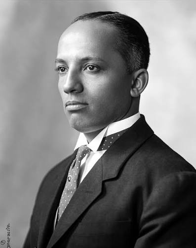

{width="80%"}

Carter G. Woodson was a historian, educator, author, and founder of important institutions dedicated to the study of Black history. He is often called the “Father of Black History” because of his work documenting, preserving, and teaching African American history.

Woodson founded the Association for the Study of Negro Life and History and established Negro History Week, which later became Black History Month. His work challenged schools, scholars, and the public to take seriously the histories, intellectual traditions, institutions, and contributions of Black people in the United States.

Dr. Woodson will serve as one of many examples to guide our questions about historical thinking, archives, schooling, and education in American society. Please watch the video below to help frame your historical analysis and archival research assignment.

<iframe width="560" height="315" src="https://www.youtube.com/embed/HiFatZu5PoU?si=h-9P9sEjexm4Yt6z" title="YouTube video player" frameborder="0" allow="accelerometer; autoplay; clipboard-write; encrypted-media; gyroscope; picture-in-picture; web-share" referrerpolicy="strict-origin-when-cross-origin" allowfullscreen></iframe>

</iframe>

</iframe>

The site photo is taken from this [National Park Service](hhttps://www.nps.gov/cawo/learn/carter-g-woodson-biography.htm){target="_blank"} by Scurlock Studio Records.
